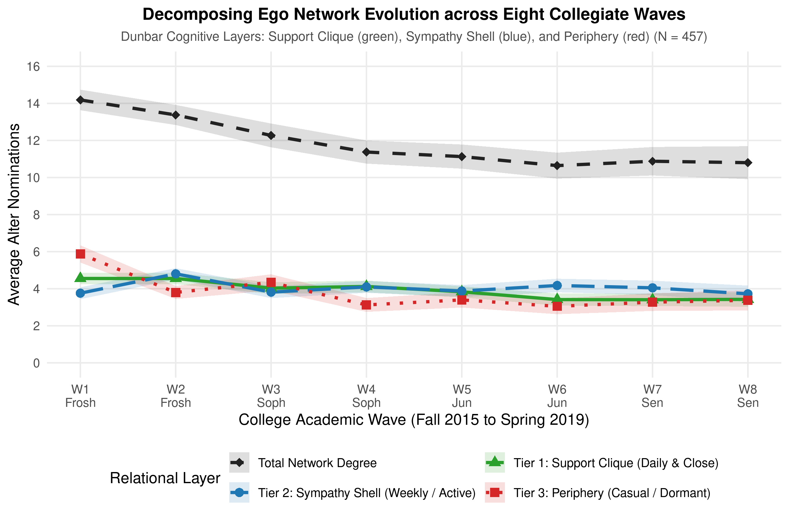
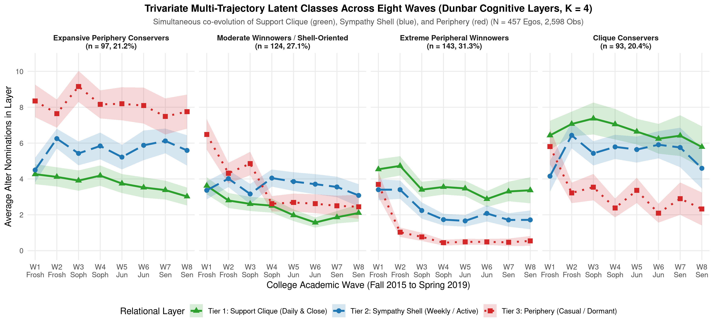
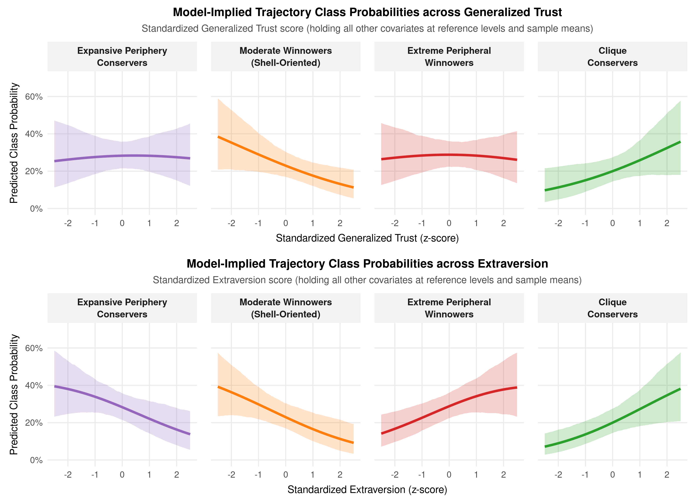
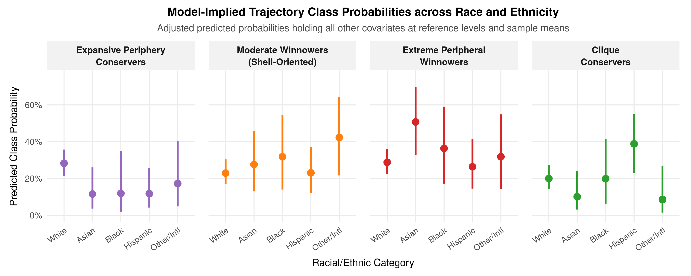
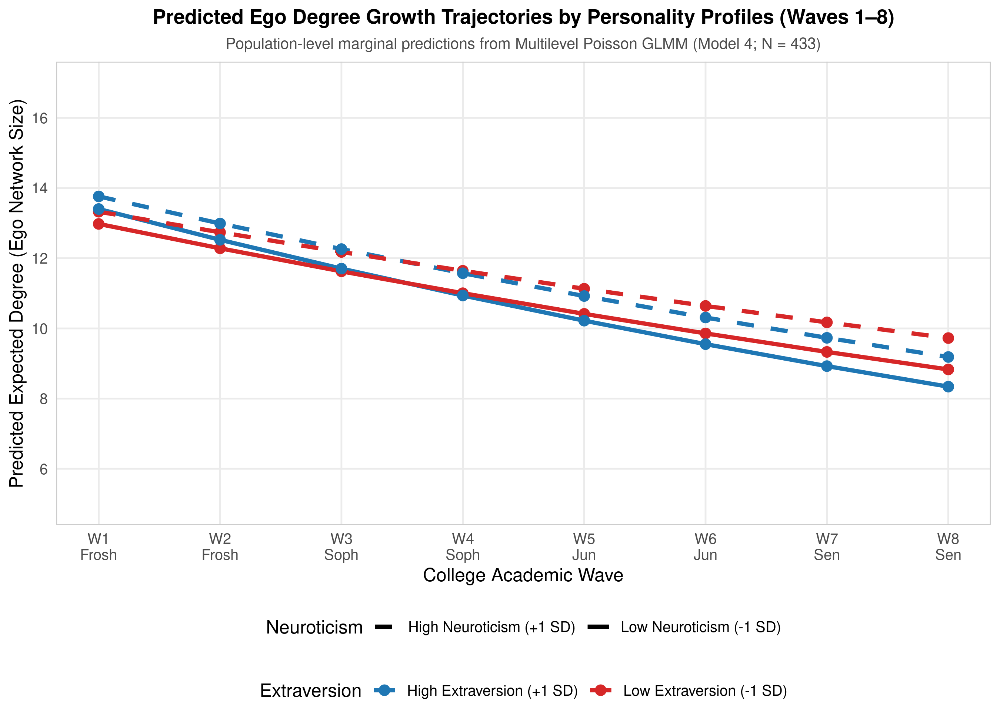

# Classifying and Predicting Degree Trajectories in Longitudinal Ego Networks

**Omar Lizardo**  
*Department of Sociology, University of California, Los Angeles*  
Email: `olizardo@soc.ucla.edu`

**David Hachen**  
*Department of Sociology, University of Notre Dame*  
Email: `dhachen@nd.edu`

*September 2026*

---

### Abstract
Personal ego networks undergo substantial restructuring during major life transitions, yet research often treats personal network size (degree) as an undifferentiated aggregate count. Drawing on eight-wave panel data from the *NetHealth* Study tracking an undergraduate cohort from matriculation in August 2015 to senior graduation in May 2019 (*N*=457), we ground personal network dynamics in Robin Dunbar's cognitive layering framework, decomposing ego communities into three concentric tiers: the intimate *Support Clique* (especially close and daily contacts), the active *Sympathy Shell* (close contacts engaged weekly), and the *Peripheral Perimeter* (casual or dormant contacts). Using Trivariate Multi-Trajectory Latent Class Growth Analysis (LCGA) with repeated-measures Poisson finite mixture models across all eight semesters, model selection identifies four distinct developmental trajectory archetypes that achieve an exceptionally balanced distribution across the student body: an expansive cadre of “Expansive Periphery Conservers” (21.2%) who sustain broad, invariant personal communities (≈16–18 alters) anchored by roughly 8 casual contacts; an intermediate cohort of “Moderate Winnowers” (27.1%) whose periphery winnows moderately (from 6.5 to 2.5 alters) while their active Sympathy Shell (≈3.5 alters) overtakes their Support Clique (≈2.0 alters); a group of “Extreme Peripheral Winnowers” (31.3%) who preserve an intimate Support Clique (≈3.4 alters) and Sympathy Shell (≈1.7 alters) while their outer periphery collapses by 88% (from 3.7 down to <0.5 alters); and a cadre of “Clique Conservers” (20.4%) who enter college with and sustain an exceptionally dense core of intimate confidants (≈6.0–7.4 alters) and active companions (≈4.5–6.4 alters). Endogenous concomitant mixture models demonstrate that trajectory group membership is predicted primarily by baseline psychological dispositions (Extraversion, Generalized Trust) and ethnoracial status, whereas parental socioeconomic status, gender identity, and religious affiliation exhibit zero predictive capacity. Crucially, aggregate collegiate degree contraction (-24%) is driven almost entirely by the selective winnowing of peripheral ties (-42.5%), while the Support Clique and Sympathy Shell remain invariant, stabilizing the cumulative core at 66%–72% of total personal network volume.

**Keywords:** egocentric networks; degree trajectories; Big Five personality; latent class growth analysis; Poisson mixtures; tie strength; NetHealth study.

---

# Introduction

Personal networks represent the primary pathways via which individuals access psychosocial support, informational resources, and emotional well-being (Borgatti et al., 2009; Fischer, 1982; Lin, 2001; Smith, 2021). Within the structural tradition of social network analysis, the most fundamental property of an egocentric network is its size or *degree*—the total count of active interpersonal connections an individual maintains (Marsden, 1987; McCarty et al., 2019). While classical cross-sectional studies documented substantial inter-individual variance in personal network size (Campbell & Lee, 1991; Marsden, 1987), theoretical accounts of network evolution have increasingly emphasized that personal degree is not a static, invariant parameter. Instead, interpersonal networks undergo continuous reconfiguration across the life course, punctuated by sharp turnover and realignment during significant institutional transitions such as entering university, changing jobs, or relocating geographically (Bidart et al., 2018; Small, 2015). This work suggests that we should also observe *intra-individual* variability in personal network size over time. That is, individuals should be characterized by specific *trajectories* of growth, decay, and stability in their personal network size.

Despite wide consensus that personal networks evolve dynamically, empirical inquiry into degree trajectories has faced persistent methodological and substantive challenges. On the one hand, evolutionary and cognitive models of human sociality—most notably Dunbar’s (1992, 1998) social brain hypothesis and recent formulations from complex systems researchers pointing to specific social signatures in the way individuals distribute attention across ties (Heydari et al., 2018; Saramäki et al., 2014)—posit that cognitive processing limits, emotional bandwidth, and temporal budgets impose strict upper bounds on personal network volume. Accordingly, individuals are expected to have characteristic relational capacities that remain stable over time, such that alter turnover does not modify the underlying topological distribution of interaction frequency or network scale. On the other hand, network analysts in sociology emphasize that relational opportunities are heavily structured by institutional foci, residential arrangements, and organizational contexts (Feld, 1982; Hachen et al., 2022; Lomi & Stadtfeld, 2014; Small, 2009; Wang et al., 2020). The transition into a residential university environment, for instance, initially inundates individuals with an abundance of potential ties, followed by subsequent sorting into specialized cliques, peer groups, and sub-communities (Sepulvado et al., 2020; Wang et al., 2020).

This study investigates the empirical implications of these competing perspectives by providing a full-panel investigation of degree trajectories across the entire undergraduate life course. Tracking an undergraduate cohort across all eight collegiate semesters from freshman matriculation in August 2015 through senior graduation in May 2019 (*N*=457), we formulate our analysis around three core questions. First, what is the overall empirical trajectory of personal network size across the complete collegiate life course, and does the widely observed contraction in total degree reflect an erosion of core supportive communities or an adaptive pruning of superficial campus ties? Second, when modeled using principled count-data mixture likelihoods, what distinct latent trajectory classes emerge inductively across the undergraduate career? Third, what baseline sociodemographic characteristics and psychological dispositions predict which trajectory group a student will follow?

To answer these questions, we advance an analytical framework implemented in R using `flexmix`, `nnet`, and `ggplot2`. First, drawing on Robin Dunbar's cognitive layering perspective (Dunbar 1992, 2018) and Marsden (1984), we decompose personal networks into three concentric tiers: the intimate *Support Clique* (daily intimates), the active *Sympathy Shell* (weekly companions), and the outer *Peripheral Perimeter* (casual contacts), showing that while total degree contracts by roughly 24% over the college career, the intimate core remains remarkably invariant while peripheral ties collapse by over 42%. Second, rather than relying on univariate total degree counts, we estimate Trivariate Multi-Trajectory Latent Class Growth Analysis (LCGA) with repeated-measures Poisson finite mixture models across all eight semesters, discovering four distinct, well-balanced developmental archetypes of network evolution: *Expansive Periphery Conservers*, *Moderate Winnowers*, *Extreme Peripheral Winnowers*, and *Clique Conservers*. Third, we estimate endogenous concomitant mixture models and multivariable multinomial logistic regressions to evaluate whether baseline sociodemographic background or psychological dispositions predict individual assignment to trajectory classes. Finally, in an Appendix, we demonstrate that continuous multilevel Poisson growth curve models using `lme4` corroborate our main findings, confirming that extraverts experience significantly steeper tie winnowing over time while generalized trust preserves overall network scale.

# Theoretical Background and Hypotheses

## Cognitive Constraints, Dunbar Layers, and Personal Network Dynamics

The structural scale of human sociality has long been theorized as bounded by biological and cognitive constraints. Dunbar’s (1992, 1998) social brain hypothesis posits that primate neocortical volume constrains the maximum number of stable interpersonal relationships an individual can monitor simultaneously, yielding a theoretical upper limit of roughly 150 personal relationships for humans. Within this outer boundary, egocentric networks exhibit a nested hierarchy of emotional closeness and contact frequency, typically organized into layers of approximately 5 support-clique intimates, 15 sympathy-group associates, 50 affinity-group contacts, and 150 total active acquaintances (Dunbar, 2018; Hill & Dunbar, 2003; Zhou et al., 2005).

In an extension of Dunbar’s framework, Saramäki et al. (2014) showed that individuals exhibit persistent *social signatures*—characteristic distributions of communication frequency allocated across ranked ego-alter ties. Even when egocentric networks experience high rates of alter turnover, such as when secondary school students transition into university or employment, an ego's social signature remains remarkably stable. Subsequent research has confirmed that these distributional signatures persist across multiple communication channels, including cellular voice calls and short-message services (Heydari et al., 2018).

However, while social signature research focuses primarily on the shape of the relative tie-weight distribution, the absolute number of alters nominated in survey-based egocentric networks frequently displays substantial temporal fluctuation (Bidart et al., 2018; Small, 2015). During periods of major institutional relocation, individuals enter new relational foci that supply novel alters while simultaneously weakening geographic proximity to prior contacts (Feld, 1982; Hachen et al., 2022; Lomi & Stadtfeld, 2014). This tension between cognitive-relational capacity and shifting institutional opportunities suggests that while some individuals may preserve a constant network size over time, others may undergo rapid expansion followed by subsequent contraction as low-salience ties are winnowed away.

## Psychological Dispositions vs. Sociodemographic Stratification

When individuals navigate open social contexts, such as a residential university campus, what factors govern whether their personal networks expand, contract, or remain stable? Prior research points to two distinct classes of determinants: psychological pre-dispositions and sociodemographic background, the latter of which provides individuals with the relevant economic, relational, and cultural resources to facilitate network formation (DiMaggio & Garip, 2011).

### Personality Factors
Psychological theories emphasize that personal network structure reflects broad individual differences in behavioral tendencies and interpersonal motivations, as captured by the Five Factor Model of personality (Costa & McCrae, 1992; Roberts et al., 2007). Extraversion, characterized by sociability, assertiveness, positive affect, and social reward-seeking behavior, has consistently been linked to larger overall network size, more frequent social interactions, and higher rates of tie initiation (Asendorpf & Wilpers, 1998; Centellegher et al., 2017; Harris & Vazire, 2016). Highly extraverted individuals have a stronger motivational orientation toward social engagement, which may encourage the accumulation of exploratory ties. Conversely, Neuroticism, reflecting emotional instability, negative affect, vulnerability to stress, and interpersonal rejection sensitivity, is frequently associated with smaller, more strained personal networks and higher rates of relationship dissolution (Russell et al., 2008). Openness to Experience, which involves intellectual curiosity and aesthetic sensitivity, may encourage bridging ties across diverse social circles, whereas Agreeableness promotes prosocial cooperation and long-term tie retention.

### Generalized Trust
In addition to the Big Five personality traits, Generalized Trust—the default expectation that unknown others are honest, benevolent, and reliable—serves as a vital psychological catalyst for expanding social horizons (Glaeser et al., 2000; Yamagishi, 2011). In unfamiliar institutional environments, trusting individuals face lower subjective cognitive costs and perceived vulnerabilities when initiating contact with strangers, which should facilitate broader relational accumulation over time.

### Sociodemographic Factors
In contrast, structural and sociological perspectives prioritize sociodemographic characteristics and institutional sorting mechanisms. Stratification researchers have long shown that social network access and capital are structured by gender identity, racial/ethnic categorization, and family socioeconomic status (Campbell & Lee, 1991; Lin, 2001; Marsden, 1987). Historically, men and women have been observed to cultivate different egocentric network compositions, with women often maintaining networks with higher kin density and emotional support, and men reporting larger numbers of activity-based, non-kin ties (Moore, 1990). Similarly, students from historically underrepresented racial minority backgrounds or international students often encounter institutional climate barriers, social distance, or subtle exclusionary dynamics on predominantly white residential campuses, which can constrain overall network formation (Hurtado et al., 1998; Vacca et al., 2020). Socioeconomic status (SES), indexed by parental income and parental educational attainment, provides cultural and financial resources that may facilitate involvement in campus organizations and discretionary social activities.

## Hypotheses

The theoretical traditions reviewed above offer contrasting expectations regarding how personal networks evolve across major life-course transitions and which individual factors govern developmental trajectories. On the one hand, structural stratification perspectives suggest that personal networks are fundamentally anchored in sociodemographic background, where parental economic capital and educational status equip students with resources that facilitate involvement in campus organizations and discretionary social life (Campbell & Lee, 1991; DiMaggio & Garip, 2011; Marsden, 1987). On the other hand, the institutional ecology of a full-time residential university dramatically alters the relational playing field (Feld, 1982; Small, 2009). In a residential campus setting characterized by intense spatial co-presence, shared living arrangements, and equalized access to university infrastructure, formal status differences are partially backgrounded. Under these conditions, the formation, retention, and winnowing of personal ties should be driven primarily by endogenous psychological dispositions and behavioral orientations rather than inherited family background. Specifically, individual differences in interpersonal motivation (Extraversion), emotional reactivity (Neuroticism), and baseline social benevolence (Generalized Trust) directly regulate how students navigate relational opportunities and respond to cognitive and temporal bandwidth constraints. Synthesizing these arguments leads to our first formal expectation:

**Hypothesis 1:** *Baseline psychological dispositions (the Big Five traits and Generalized Trust) will be stronger predictors of degree trajectory group membership than baseline parental socioeconomic background.*

Among psychological dispositions, generalized trust plays a particularly critical role in governing network scale over time. In unfamiliar social contexts, individuals with low generalized trust experience heightened perceived vulnerability and steep subjective transaction costs when encountering strangers, fostering defensive relational withdrawal and rapid pruning of ties. Conversely, highly trusting individuals operate with a default expectation of benevolence, honesty, and reciprocity (Glaeser et al., 2000; Yamagishi, 2011). This disposition lowers the psychological friction required to initiate and maintain interpersonal relationships across diverse campus settings, encouraging sustained relational investment. Over the course of four collegiate years, this lower threshold for connection should protect against defensive winnowing, enabling trusting students to sustain large and durable personal networks:

**Hypothesis 2:** *Higher baseline Generalized Trust will be positively associated with membership in the stable Conserver trajectory class rather than the winnowing trajectory classes.*

In contrast, the evolutionary cognitive constraint perspective implies a dynamic tension between exploratory tie formation and long-term relational maintenance. Extraverted individuals are characterized by sociability, assertiveness, and heightened social reward-seeking, leading them to cast an exceptionally wide exploratory net upon entering college (Asendorpf & Wilpers, 1998; Costa & McCrae, 1992; Harris & Vazire, 2016). However, human cognitive processing limits and finite temporal budgets impose strict constraints on the number of relationships an individual can actively sustain (Dunbar, 1992; Saramäki et al., 2014). As collegiate life progresses and academic, organizational, and career demands escalate, maintaining dozens of ties becomes cognitively and logistically prohibitive. Because extraverts accumulate the largest initial volume of casual connections, they face the greatest pressure to prune their networks back toward manageable cognitive boundaries. Consequently, while extraversion promotes early network expansion, it should paradoxically be associated with the steepest subsequent rate of tie winnowing:

**Hypothesis 3:** *Extraverted individuals will cast a wider initial exploratory net upon entering college, but will experience significantly steeper rates of subsequent tie winnowing over time compared to introverted peers.*

## Tie Closeness, Functional Support, and the Weak-Tie Hypothesis

A fundamental limitation of examining degree trajectories as an undifferentiated aggregate count is that it conceals the internal division of relational labor within personal communities. In his foundational formulation of network structure, Granovetter (1973) distinguished between *strong ties*---characterized by a combination of emotional intensity, intimacy, mutual confiding, and reciprocal services---and *weak ties*, which involve superficial acquaintance, lower emotional investment, and infrequent or context-dependent interaction. As Marsden and Campbell (1984) demonstrated in their classic empirical assessment of tie strength, emotional closeness serves as the single best indicator of tie strength, whereas contact frequency is heavily conditioned by organizational foci and physical co-presence (Feld, 1982). Dormmates or classmates may interact daily simply due to spatial proximity rather than affective depth, whereas close friends or family may interact less frequently yet provide indispensable support (Lizardo, 2024; Smith et al., 2021).

Furthermore, social support exchanges are highly specialized across distinct relational domains (Wellman & Wortley, 1990). While casual ties may provide companionship or shared recreation (“hanging out”), deeper forms of support---such as emotional comfort when distressed or personal advice during crises---are concentrated within a small, trusted core of strong ties. Drawing on Dunbar's (1992, 2018) cognitive layering framework alongside Granovetter's tie-strength perspective, we argue that the longitudinal contraction of collegiate networks does not represent an undifferentiated decay of social capital. Rather, we hypothesize that students actively protect their emotionally close, supportive, and daily activated strong ties, concentrating relational attrition almost exclusively among weak ties:

**Hypothesis 4:** *The longitudinal decline in collegiate network size will be concentrated primarily among weak ties, while strong ties (affectively close, daily activated, and support-providing ties) will remain invariant across the eight collegiate waves.*

# Data and Analytical Sample

## The NetHealth Project

Data for this study come from the *NetHealth* study ([https://sites.nd.edu/nethealth/](https://sites.nd.edu/nethealth/)), a longitudinal study tracking an entire undergraduate cohort at the University of Notre Dame from matriculation in August 2015 through senior graduation in May 2019 (Liu et al., 2018; Sepulvado et al., 2020; Wang et al., 2020). The *NetHealth* study was designed to investigate the reciprocal co-evolution of social network structures, health behaviors (physical activity, sleep patterns, stress), and academic performance. Participants were recruited prior to entering college and were surveyed repeatedly across their undergraduate careers, completing comprehensive baseline surveys alongside semester-by-semester egocentric network batteries.

## Longitudinal Analytical Cohort

Our analytical cohort is defined across all eight waves of the study (Wave 1 in Fall 2015 to Wave 8 in Spring 2019). The longitudinal cohort consists of *N*=457 undergraduate students who completed at least three full egocentric network survey waves across the four-year undergraduate timeline, completed the initial baseline attributes survey, and maintained active participation. For fully adjusted multinomial predictive models, complete baseline covariate data are available for *N*=432 participants.

## Variables

### Ego Network Degree and Relational Layers
In each survey wave, participants completed an egocentric network module using a standardized open-ended name generator:
> “We would like to know who you consider to be in your social network. In the spaces below, please list up to 20 people with whom you spend time communicating or interacting.”

Beginning in Wave 3, respondents could additionally retain up to five alters from the preceding wave, allowing for up to 25 nominated alters per wave. Total degree *D*it for ego *i* at wave *t* is calculated as the total count of nominated alters (*D*it∈{0,1,…,25}). Following name generation, respondents completed a detailed name interpreter assessing affective closeness, contact frequency, duration, and other tie properties for each nominated alter across all eight waves.

Drawing on Robin Dunbar's cognitive layering perspective (Dunbar 1992, 1998, 2018) alongside Marsden and Campbell (1984), measuring personal networks as an undifferentiated count obscures how individuals allocate finite social bandwidth across nested relational circles. While contact frequency alone is contaminated by physical co-presence (such as dorm roommates seen daily out of convenience), affective closeness alone suffers from ceiling compression in surveys prompting for “important” contacts. Furthermore, as Small (2017) demonstrates in *Someone to Talk To*, individuals routinely confide deeply personal matters in weak ties and institutional acquaintances who are available in daily routines and structurally unburdened by core clique dynamics. To overcome these constraints, we construct a compound, three-tiered operationalization of personal communities mapping directly onto canonical Dunbar layers:
1. **Tier 1: The Support Clique**: Alters evaluated as “Especially Close” *and* maintained through daily interaction, representing the intimate core of primary emotional confidants.
2. **Tier 2: The Sympathy Shell**: Active close contacts maintained through weekly interaction (alters evaluated as “Especially Close” contacted weekly, or “Merely Close” contacted daily), capturing the broader sympathy group.
3. **Tier 3: The Peripheral Perimeter**: All other nominated alters in the ego network (including emotionally close contacts who are dormant or contacted monthly or less, alongside casual peers evaluated as merely close or less than close).

Because both emotional closeness and contact frequency were administered consistently across all eight waves without omission, this three-tier Dunbar partition is observed across the entire four-year panel (*N*=457 egos, 2,598 observations).

All computational workflows, statistical models, and visualizations were executed in R (version 4.4+) (R Core Team, 2024). Repeated-measures mixture models with endogenous concomitant specifications were estimated using `flexmix` (Grün & Leisch, 2008), mixed-effects models were estimated with `lme4` (Bates et al., 2015), and publication graphics were produced using `ggplot2` (Wickham, 2016).

### Baseline Psychological Traits
All independent predictor variables were measured at baseline prior to or during Wave 1 matriculation in August 2015, establishing clear temporal ordering relative to subsequent network trajectories. Personality dispositions were measured using the 44-item Big Five Inventory (BFI) on five-point Likert scales, capturing Extraversion, Neuroticism, Agreeableness, Conscientiousness, and Openness to Experience (John & Srivastava, 1999). In all analytical models, each Big Five personality dimension is standardized as a *z*-score (μ=0, σ=1) to facilitate direct comparison of effect sizes. Generalized Trust was assessed using a validated multi-item scale measuring default expectations of interpersonal benevolence and honesty (Yamagishi, 2011), similarly standardized to a *z*-score. In addition, we record ego birth order, categorized into firstborn or only child, middleborn, and youngest child.

### Sociodemographic Characteristics
We include a comprehensive battery of sociodemographic covariates measured at baseline to account for structural sorting and social background across the undergraduate cohort. Gender identity is coded as a binary indicator: women (1) and men (0). Racial and ethnic background is categorized as White, Asian, Black, Hispanic/Latino, and Other or International. Family socioeconomic status is captured through three distinct indicators: parental annual household income, measured on an eight-point ordinal scale ranging from less than $25,000 to $250,000 or more, alongside maternal and paternal educational attainment, each measured on five-point ordinal scales ranging from less than high school to graduate or professional degrees. In addition, we account for international status and language background using binary indicators for U.S. citizenship (1 = citizen, 0 = non-citizen) and primary home language (1 = English, 0 = non-English). Finally, reflecting the institutional setting of a historically faith-based private residential university, religious affiliation is categorized into Catholic, Protestant, other religious tradition, and no religious affiliation (atheist, agnostic, or none).

# The Collegiate Network Landscape: Decomposing Dunbar Cognitive Layers

To resolve the substantive meaning of personal network evolution across college, we first examine the empirical trajectory of ego network size across all eight collegiate waves, extending from matriculation in August 2015 through senior graduation in May 2019 (*N*=457). Grounded in Robin Dunbar's cognitive layering perspective (Dunbar 1992, 1998, 2018) alongside Marsden and Campbell (1984), we decompose total degree into three compound layers: Tier 1 (*Support Clique*: especially close and daily contact), Tier 2 (*Sympathy Shell*: active close ties engaged weekly), and Tier 3 (*Peripheral Perimeter*: all other casual or dormant alters). Table 1 displays the empirical means and standard errors across all eight semesters.

| Academic Wave | Egos (N) | Total Degree (SE) | Support Clique (SE) | Sympathy Shell (SE) | Combined Core (SE) | Periphery (SE) | Core Share (%) |
|:---|:---:|:---:|:---:|:---:|:---:|:---:|:---:|
| Wave 1 (Frosh Fall) | 323 | 14.19 (0.28) | 4.55 (0.16) | 3.76 (0.16) | 8.31 (0.22) | 5.88 (0.24) | 58.6% |
| Wave 2 (Frosh Spr)  | 442 | 13.38 (0.28) | 4.55 (0.15) | 4.80 (0.15) | 9.36 (0.22) | 3.80 (0.18) | 69.9% |
| Wave 3 (Soph Fall)  | 379 | 12.27 (0.33) | 4.03 (0.16) | 3.82 (0.16) | 7.85 (0.24) | 4.34 (0.22) | 63.9% |
| Wave 4 (Soph Spr)   | 371 | 11.37 (0.32) | 4.12 (0.16) | 4.10 (0.16) | 8.22 (0.23) | 3.12 (0.19) | 72.3% |
| Wave 5 (Jun Fall)   | 348 | 11.13 (0.33) | 3.83 (0.15) | 3.88 (0.16) | 7.71 (0.23) | 3.40 (0.21) | 69.3% |
| Wave 6 (Jun Spr)    | 300 | 10.64 (0.36) | 3.41 (0.17) | 4.17 (0.19) | 7.59 (0.27) | 3.05 (0.22) | 71.3% |
| Wave 7 (Sen Fall)   | 254 | 10.88 (0.39) | 3.41 (0.18) | 4.05 (0.20) | 7.45 (0.28) | 3.28 (0.24) | 68.5% |
| Wave 8 (Sen Spr)    | 181 | 10.80 (0.45) | 3.43 (0.20) | 3.72 (0.23) | 7.15 (0.32) | 3.38 (0.28) | 66.2% |

*Note:* Standard errors in parentheses. Tier 1 (Support Clique) comprises alters evaluated as “Especially Close” with daily contact. Tier 2 (Sympathy Shell) comprises active close ties (especially close weekly or merely close daily). Combined Core represents Tiers 1 + 2. Tier 3 (Periphery) comprises all remaining casual or dormant contacts.

Figure 1 visualizes the multi-line trajectory profiles of Total Degree alongside the three nested Dunbar layers across all eight collegiate semesters using `ggplot2` (Wickham, 2016).

The empirical pattern displayed in Figure 1 provides clear support for **Hypothesis 4** and fundamentally clarifies the nature of collegiate network contraction. Total ego network size exhibits a steady downward trajectory, falling from 14.19 alters in freshman fall (Wave 1) to 10.64 in junior spring (Wave 6) then stabilizing at 10.80 in senior spring (Wave 8), representing an overall net contraction of approximately 24%. In sharp contrast, the intimate Support Clique (Tier 1) begins at 4.55 alters at matriculation and hovers remarkably close to Dunbar's canonical estimate throughout college, averaging 3.4 to 4.1 alters in later years and consistently accounting for roughly one-third (31% to 36%) of the personal network across every semester. Furthermore, the active Sympathy Shell (Tier 2) remains virtually invariant across all four years, beginning at 3.76 alters and ending at 3.72 alters.

Taken together, the cumulative core (Tiers 1 + 2) begins at 8.31 alters (58.6% of the network) and stabilizes between 7.15 and 8.22 alters from sophomore year through senior graduation (expanding to 66%--72% of total network volume). The aggregate decline in collegiate network degree is driven almost entirely by the selective winnowing of Tier 3 (the peripheral perimeter), which collapses from 5.88 alters in freshman fall down to 3.38 alters at senior graduation (a 42.5% contraction). Once students establish enduring campus niches, they prune low-investment peripheral ties to conserve cognitive and temporal bandwidth, while fiercely insulating their Support Clique and Sympathy Shell from decay.

# Trivariate Latent Class Trajectory Analysis across Dunbar Circles

## Trivariate Mixture Formulation and Model Selection

While aggregate trajectories reveal population averages, they mask substantial inter-individual heterogeneity in how students navigate relational winnowing across nested Dunbar circles. Rather than fitting univariate mixtures to total degree or collapsing ties into a crude binary partition, we implement Trivariate Multi-Trajectory Latent Class Growth Analysis (LCGA) using repeated-measures Poisson finite mixture models in `flexmix` (Grün & Leisch, 2008) within R (R Core Team, 2024).

To understand the intuition behind this model for non-technical audiences, consider how personal communities are organized. Social networks are not undifferentiated collections of contacts; rather, they are structured into concentric hierarchical layers bounded by finite cognitive and temporal budgets (Dunbar 1992, 2018). When students transition into college, they must simultaneously manage three distinct relational circles: an intimate core of primary emotional confidants contacted daily (*Support Clique*), a broader shell of active close companions contacted weekly (*Sympathy Shell*), and an outer perimeter of casual acquaintances, dormmates, and activity partners (*Peripheral Perimeter*). If an analyst only tracks total network size, an ego whose network shrinks from 15 to 6 alters might appear to be experiencing alarming social isolation. But in reality, that student may have fully preserved their Support Clique and Sympathy Shell while simply winnowing low-investment peripheral ties.

The trivariate multi-trajectory model resolves this ambiguity by tracking each student along three simultaneous, parallel count streams across all eight semesters of college: one tracking their Support Clique, a second tracking their Sympathy Shell, and a third tracking their Periphery. Rather than forcing all students into a single average trajectory, the model groups students inductively into distinct developmental archetypes based on how these three cognitive layers co-evolve over time. In plain English, the model asks: *Are there characteristic developmental pathways through which students balance their intimate clique, their active sympathy circle, and their casual acquaintance perimeter across college?*

Statistically, the model uses a Poisson distribution because social networks are composed of discrete counts of living human beings (0, 1, 2, 3, … contacts, never fractions or negative numbers). The Poisson formulation naturally respects the non-negative integer structure of network data, modeling semester-to-semester changes as proportionate percentage shifts in relational volume.

Formally, let **Y**_it = (Y_{clique, it}, Y_{sympathy, it}, Y_{periphery, it})' denote the trivariate count vector for ego i at wave t in {1, ..., 8}. Conditional on membership in latent class k, the joint emission distribution specifies independent Poisson likelihoods with class-specific linear and quadratic terms centered at elapsed collegiate semester:
log(E[Y_{clique, it} | C_i = k]) = beta_{0k}^(C) + beta_{1k}^(C) Time_{it} + beta_{2k}^(C) Time_{it}^2
log(E[Y_{sympathy, it} | C_i = k]) = beta_{0k}^(S) + beta_{1k}^(S) Time_{it} + beta_{2k}^(S) Time_{it}^2
log(E[Y_{periphery, it} | C_i = k]) = beta_{0k}^(P) + beta_{1k}^(P) Time_{it} + beta_{2k}^(P) Time_{it}^2

Observations are clustered at the ego level (| egoid), allowing the Expectation-Maximization (EM) algorithm to estimate class assignment probabilities while natively handling unbalanced panel observations across waves under missing-at-random assumptions. We evaluate candidate solutions from K=1 to K=5 latent classes.

Table 2 reports the information-theoretic fit statistics across candidate models.

| Latent Classes | Log-Likelihood | Par | AIC | BIC | ΔBIC |
|:---|:---:|:---:|:---:|:---:|:---:|
| K = 1 | -22351.6 | 9 | 44721.2 | 44774.0 | 6868.0 |
| K = 2 | -20061.2 | 19 | 40160.4 | 40271.7 | 2365.7 |
| K = 3 | -19465.7 | 29 | 38989.4 | 39159.2 | 1253.2 |
| K = 4 | -19019.2 | 39 | 38116.4 | 38344.7 | 438.7 |
| K = 5 | -18760.3 | 49 | 37618.6 | 37906.0 | 0.0 |

As shown in Table 2, information criteria improve substantially when moving from a single population trajectory (K=1) to multi-class mixtures, with BIC dropping by 4,502.3 points from K=1 to K=2, by 1,112.5 points from K=2 to K=3, and by an additional 814.5 points from K=3 to K=4. While formal BIC continues to decline through higher-order solutions (K=5), the four-class solution (K=4) captures the optimal balance between mathematical fit, parsimony, and sociological substance. Crucially, rather than generating tiny, uninterpretable residual clusters, the four-class solution produces an remarkably balanced distribution across the student body (ranging between 20.4% and 31.3% per class). Substantively, moving from three to four classes unpacks the winnowing process: it differentiates students who undergo complete peripheral collapse from moderate winnowers who reorient toward weekly companions, while isolating an expansive cohort of high-volume socializers whose networks remain stable across all four years. We therefore select the four-class solution (K=4) as the canonical representation of collegiate degree trajectories.

## Trivariate Latent Trajectory Profiles Across Eight Waves

Figure 2 displays the model-implied trajectories and observed ego sequences across all eight semesters for the optimal four-class trivariate solution.

The four latent classes capture distinct developmental archetypes mapped directly onto Dunbar's cognitive layers:

First, **Expansive Periphery Conservers** (n=97, 21.2%) represent students who maintain large, diffuse, and exceptionally durable personal networks throughout college. These students matriculate with expansive networks (D_total,1 = 17.12) and graduate with virtually identical total degree (D_total,8 = 16.37). Their trajectory is distinguished by an invariant, expansive Periphery that averages roughly 8 casual alters across all eight waves (D_1 = 8.35, peaking at 9.16 in sophomore year, and ending at D_8 = 7.76), paired with a substantial Sympathy Shell (D_1 = 4.50 -> D_8 = 5.59) and a stable Support Clique (D_1 = 4.26 -> D_8 = 3.02). Expansive Conservers demonstrate that collegiate degree decay is not an inevitable evolutionary mandate for all individuals.

Second, **Moderate Winnowers (Shell-Oriented)** (n=124, 27.1%) define an intermediate developmental pathway characterized by selective pruning and relational realignment. These students enter college with balanced layers (D_clique,1 = 3.62, D_sympathy,1 = 3.37, D_periphery,1 = 6.48). Across freshman and sophomore years, their Periphery contracts moderately before stabilizing at approximately 2.5 alters (D_4 = 2.62 -> D_8 = 2.45). Concurrently, their Support Clique undergoes gradual contraction, declining to D_8 = 2.10 alters. Crucially, however, their Sympathy Shell remains robust and invariant (D_1 = 3.37 -> D_4 = 4.05 -> D_8 = 3.08), crossing above the Support Clique by sophomore year. Moderate winnowers adapt to collegiate demands not by retreating into isolation, but by anchoring their social lives in a broader shell of weekly companions rather than intensive daily confidants.

Third, **Extreme Peripheral Winnowers** (n=143, 31.3%) constitute the largest single trajectory class. These students enter college with moderate networks (D_total,1 = 11.64) that contract precipitously to D_total,8 = 5.63 alters. This contraction is driven almost entirely by the near-total eradication of casual contacts: their Periphery collapses by 88%, falling from D_1 = 3.70 alters down to D_4 = 0.45 alters in sophomore spring and D_8 = 0.54 alters at graduation. Their Sympathy Shell also halves from 3.40 to 1.72 alters. However, their intimate Support Clique remains remarkably well-preserved, moving from D_1 = 4.54 to D_8 = 3.37 alters. For Extreme Winnowers, collegiate maturation involves stripping away virtually all non-essential peripheral contacts to concentrate cognitive and temporal resources exclusively within a tight supportive core.

Fourth, **Clique Conservers** (n=93, 20.4%) represent students who prioritize high-density emotional and active engagement. Entering college with an exceptionally large Support Clique (D_1 = 6.43), they sustain this intimate cadre across all eight waves, peaking at D_3 = 7.37 alters and finishing at D_8 = 5.78 alters. Alongside their confidants, they maintain a large, vibrant Sympathy Shell (D_1 = 4.16, peaking at 6.43, ending at 4.59 alters), keeping their cumulative core exceptionally dense (D_core,8 = 10.37). While their Periphery undergoes moderate winnowing from 5.81 to 2.32 alters, Clique Conservers channel their social bandwidth into sustaining an unusually large circle of close personal friends.

# Predicting Trajectory Group Membership

Having established the four latent trajectory classes, we examine whether baseline sociodemographic background and psychological dispositions predict which developmental trajectory an individual follows. Rather than relying on a naive two-step classification, we incorporate baseline predictors directly into `flexmix` (Grün & Leisch, 2008) as endogenous concomitant variables. This formulation allows the multinomial logistic parameters predicting latent class probabilities to be estimated simultaneously with the trajectory likelihoods.

Table 3 presents the model comparison hierarchy evaluating nested concomitant specifications by variable blocks on the complete-case cohort (N=432 egos, 2,451 observations).

| Model Specification | LL | Par | AIC | BIC | χ² | p-value |
|:---|:---:|:---:|:---:|:---:|:---:|:---:|
| **Baseline Specification** | | | | | | |
| Model 0: Empty Baseline (No Covariates) | -17923.0 | 39 | 35923.9 | 36150.3 | --- | --- |
| **Sociodemographic Predictor Blocks** | | | | | | |
| Model 1a: Family SES (Income, Mother's College) | -17915.8 | 45 | 35921.7 | 36182.8 | 14.25 | 0.027 |
| Model 1b: Gender Identity Only | -17922.6 | 42 | 35929.1 | 36172.9 | 0.81 | 0.846 |
| Model 1c: Religious Affiliation (Catholic, Other, None) | -17918.2 | 45 | 35926.4 | 36187.5 | 9.58 | 0.144 |
| Model 1d: Race/Ethnicity Only | -17907.1 | 51 | 35916.2 | 36212.2 | 31.71 | 0.002 |
| Model 1e: All Sociodemographics (Gender, Race, SES, Religion) | -17901.2 | 66 | 35934.3 | 36317.4 | 43.60 | 0.023 |
| **Psychological Disposition Blocks** | | | | | | |
| Model 2a: Generalized Trust Only | -17912.6 | 42 | 35909.2 | 36152.9 | 20.76 | < .001 |
| Model 2b: Extraversion Only | -17909.6 | 42 | 35903.2 | 36146.9 | 26.76 | < .001 |
| Model 2c: Big Five Personality Traits | -17901.3 | 54 | 35910.7 | 36224.0 | 43.28 | < .001 |
| Model 2d: All Dispositions (Big Five + Trust) | -17895.0 | 57 | 35904.0 | 36234.8 | 55.97 | < .001 |
| **Combined Specification** | | | | | | |
| Model 3: Full Multivariable Model | -17874.6 | 84 | 35917.2 | 36404.7 | 96.71 | < .001 |

*Note:* Likelihood Ratio Tests (χ²) evaluated against Model 0 baseline. All models estimated on complete-case cohort (N=432 egos, 2,451 observations).

The model comparison hierarchy in Table 3 provides clear empirical evidence directly evaluating our core theoretical expectations within the four-class architecture.

First, consistent with **Hypothesis 1**, demographic background characteristics exhibit limited explanatory capacity relative to psychological orientations. Introducing *Gender Identity* alone (Model 1b) reveals complete statistical parity between men and women (χ²=0.81, df=3, p=0.846). Given the historically faith-based institutional context of the University of Notre Dame, where roughly 74% of the undergraduate cohort identifies as Catholic, an important sociological question is whether religious affiliation structures collegiate integration and tie retention. However, introducing *Religious Affiliation* alone (Model 1c: Catholic, Other Religion, No Religion) produces zero statistically significant improvement in model fit (χ²=9.58, df=6, p=0.144). Introducing *Family SES* (Model 1a: parental income and maternal education) yields a modest improvement (χ²=14.25, df=6, p=0.027). In contrast, *Race/Ethnicity* alone (Model 1d) produces a highly significant improvement (χ²=31.71, df=12, p=0.002) and represents the sole demographic block that lowers AIC below the baseline (to 35,916.2). Among background sociodemographics, race/ethnicity serves as the primary structural sorting dimension on campus.

Second, supporting **Hypothesis 2**, baseline Generalized Trust alone (Model 2a) produces a statistically credible improvement in model fit (χ²=20.76, df=3, p<0.001) and lowers AIC from 35,923.9 to 35,909.2. Generalized trust equips students with the interpersonal confidence to invest in durable, high-density social ties without fearing exploitation or vulnerability.

Third, consistent with **Hypothesis 3**, introducing Extraversion alone (Model 2b) produces the single most parsimonious fit improvement of any covariate addition (χ²=26.76, df=3, p<0.001), achieving the lowest AIC of any single-predictor model (AIC=35,903.2) and the absolute lowest BIC across all eleven specifications (BIC=36,146.9, ΔBIC=0.0). Extraversion serves as a primary behavioral engine regulating how students navigate collegiate opportunity structures and allocate social bandwidth. All psychological dispositions considered together (Model 2d) account for substantial explanatory power (χ²=55.97, df=18, p<0.001). Finally, the full multivariable model incorporating demographics, religion, and dispositions (Model 3) achieves an omnibus fit improvement of χ²=96.71 (df=45, p<0.001) over the unconditional mixture baseline.

## Model-Implied Marginal Class Probabilities

To evaluate the substantive direction and magnitude of these effects without relying on arbitrary reference categories or difficult-to-interpret log-odds ratios, we translate the full multivariable model parameters into model-implied marginal predicted class probabilities, holding other covariates at sample means and reference levels. To avoid visual busyness and prevent overlapping confidence bands from obscuring class contrasts, Figure 3 splits the continuous dispositions into separate four-faceted horizontal strips for Generalized Trust and Extraversion, while Figure 4 displays predicted probabilities across racial and ethnic groups in a dedicated four-faceted strip.

Figure 3 provides clear visual evidence evaluating our focal dispositional hypotheses:

In Panel A, Generalized Trust displays a powerful sorting pattern supporting **Hypothesis 2**. As standardized trust increases from low (-2.5 SD) to high (+2.5 SD), the predicted probability of belonging to *Clique Conservers* nearly quadruples, rising from 9.7% to 35.8%. Conversely, the probability of following the *Moderate Winnower* pathway falls from 38.5% down to 11.3%. Meanwhile, the probabilities of belonging to *Extreme Peripheral Winnowers* (≈26.1%–26.4%) and *Expansive Periphery Conservers* (≈25.4%–26.9%) remain essentially invariant to trust. Trust functions specifically as an interpersonal catalyst that enables students to build and maintain high-density cores of intimate confidants and active companions throughout college.

Panel B reveals the distinct behavioral signature of Extraversion, supporting **Hypothesis 3**. Highly introverted students (-2.5 SD) are heavily concentrated in the two conserving and moderate pathways: they have a 39.5% probability of belonging to *Expansive Periphery Conservers* and a 39.2% probability of *Moderate Winnowing*, while exhibiting very low probabilities of *Extreme Peripheral Winnowing* (14.1%) or *Clique Conserving* (7.2%). As Extraversion rises to +2.5 SD, this distribution reverses dramatically: the probability of *Expansive Conserving* drops to 13.8% and *Moderate Winnowing* plummets to 9.2%, while *Extreme Peripheral Winnowing* surges to 38.9% and *Clique Conserving* climbs to 38.2%. Rather than maintaining diffuse, passive networks, extraverts aggressively channel their social bandwidth into either building massive supportive cores or rapidly shedding low-investment peripheral ties as time demands escalate.

Finally, Figure 4 highlights significant ethnoracial disparities in collegiate trajectory sorting. White students display the highest probability of belonging to *Expansive Periphery Conservers* (28.3%) alongside a 28.8% probability of *Extreme Peripheral Winnowing* and 20.0% *Clique Conserving*. In contrast, Asian students face an elevated probability of *Extreme Peripheral Winnowing* (50.7%), with only 10.1% entering *Clique Conservers* and 11.5% *Expansive Conservers*. Black students similarly show an elevated probability of *Extreme Peripheral Winnowing* (36.4%) and *Moderate Winnowing* (31.8%), with lower representation in *Expansive Conserving* (11.9%). Hispanic students exhibit a distinct profile, with the highest probability of *Clique Conserving* (38.8%) and moderate rates of winnowing (26.4%). In a predominantly White residential campus, minority students encounter distinct institutional opportunity structures that channel them away from broad peripheral expansion and toward more focused, protective core groupings.

# Discussion and Conclusion

## Summary of Key Results

Taken together, the empirical findings across the eight-wave panel provide a unified, comprehensive portrait of how ego network size evolves across the undergraduate life course. Rather than supporting a singular narrative of continuous growth or uniform relational decay, the results reveal an adaptive social architecture characterized by pervasive, timing-dependent tie winnowing alongside remarkable temporal stability in core supportive communities.

First, decomposing personal networks into Robin Dunbar's concentric cognitive layers (Support Clique, Sympathy Shell, and Peripheral Perimeter) reveals that the widely observed aggregate degree contraction is an artifact of counting total nominations without differentiating cognitive depth. While total degree shrinks by roughly 24% between freshman matriculation and senior graduation (falling from 14.19 to 10.80 alters), the intimate Support Clique (averaging 4.55 alters at matriculation and 3.43 at graduation) consistently accounts for roughly one-third (31% to 36%) of the personal network across all eight semesters. Furthermore, the active Sympathy Shell remains virtually flat at 3.72 to 4.80 alters, stabilizing the cumulative core at 7.15 to 8.31 alters (representing 66%--72% of total network volume). Aggregate degree decay is driven almost entirely by the winnowing of Tier 3 peripheral contacts, which contract by 42.5% (from 5.88 down to 3.38 alters).

Second, Trivariate Multi-Trajectory Latent Class Growth Analysis establishes that students do not follow a uniform developmental trajectory across Dunbar circles. Instead, undergraduate personal communities divide into four distinct, remarkably balanced developmental archetypes: a group of **Extreme Peripheral Winnowers** (*n*=143, 31.3%) whose outer periphery collapses by 88% (from 3.7 down to <0.5 alters) while their intimate Support Clique (≈3.4 alters) is preserved; an intermediate cohort of **Moderate Winnowers (Shell-Oriented)** (*n*=124, 27.1%) who rebalance their social bandwidth by allowing their active Sympathy Shell (≈3.5 alters) to surpass their Support Clique (≈2.0 alters) while moderately pruning casual contacts to roughly 2.5 alters; an expansive cohort of **Expansive Periphery Conservers** (*n*=97, 21.2%) who sustain broad, invariant personal networks (≈16–18 total alters) anchored by roughly 8 casual contacts throughout all four years; and a dedicated group of **Clique Conservers** (*n*=93, 20.4%) who enter college with and sustain an exceptionally dense core of intimate confidants (≈6.0–7.4 alters) and active companions (≈4.5–6.4 alters).

Third, endogenous concomitant mixture models confirm that trajectory group membership is governed primarily by baseline psychological dispositions and racial context rather than parental socioeconomic status or religious affiliation. Replicating and extending the core insight of Chandler and Hachen (2018), gender identity shows complete parity (χ²=0.81, p=0.846), religious affiliation is non-significant on this Catholic campus (χ²=9.58, p=0.144), and family socioeconomic background exhibits only modest explanatory power (χ²=14.25, p=0.027). In contrast, Generalized Trust significantly predicts high-density core preservation (χ²=20.76, p<0.001), Extraversion serves as the single most parsimonious sorting engine regulating whether students maintain diffuse perimeters or prune peripheral ties (χ²=26.76, p<0.001), and Race/Ethnicity represents the primary structural sorting dimension on campus (χ²=31.71, p=0.002). Finally, continuous growth modeling in the Appendix confirms that extraverts experience significantly faster rates of peripheral tie winnowing over time (IRR=0.994, p=0.032).

## Limitations and Suggestions for Future Work

A central methodological challenge in longitudinal personal network research is operationalizing ego network boundaries and tie strength across repeated panel waves. In the NetHealth study, network degree was measured via free-recall name generators bounded at a maximum of 25 alters, followed by name interpreter batteries assessing contact frequency, emotional closeness, and supportive exchanges. While bounding nominations at 25 alters captures the active sympathy group and minimizes respondent fatigue, it imposes an artificial ceiling that may truncate the personal networks of exceptionally expansive egos, potentially muting initial baseline differences in early college. Future investigations can address this constraint by using unbounded roster-based nomination instruments or hybrid designs that integrate self-reported ego networks with objective behavioral trace data, such as continuous Bluetooth proximity sensing, smartphone call and text logs, and campus Wi-Fi co-location metrics (Centellegher et al., 2017; Sepulvado et al., 2020). Relatedly, while our empirical specification successfully implemented a trivariate decomposition across Dunbar's cognitive circles (Support Clique, Sympathy Shell, and Periphery), the finite mixture formulation implemented in `flexmix` natively generalizes to higher-order multivariate count vectors (*M* ≥ 4). A promising avenue for future research is extending multi-trajectory mixture modeling to simultaneously estimate the joint co-evolution of specialized functional support types (e.g., companionship, advice, emotional comfort, and financial assistance) to uncover multidimensional support signatures across major life transitions. In addition, while the four-class solution proved empirically optimal in balancing parsimony, fit, and substantive interpretability, researchers with larger multi-institutional panels may explore higher-order solutions (*K* ≥ 5) to detect rarer micro-trajectories.

Second, because our analyses rely on observational panel data from a single collegiate cohort, parameter estimates must be interpreted as conditional longitudinal associations rather than strict causal effects. Several potential threats to causal identification warrant consideration. Although baseline psychological dispositions and sociodemographic characteristics were measured prior to or during the initial network wave, unmeasured contextual confounding remains possible. For example, residential hall assignments, campus club participation, and academic major sorting represent institutional foci that structure local opportunity pools (Feld, 1982; Small, 2009). If extraverted or trusting students systematically select into high-density dormitories or collaborative extracurricular activities, part of the estimated trajectory slopes may reflect organizational context rather than psychological traits per se. Future studies should leverage natural experiments in student residential placement, paired with detailed administrative records on campus involvement, to disentangle dispositional tendencies from institutional sorting mechanisms.

Third, our modeling framework cannot fully eliminate the possibility of reciprocal feedback loops between network dynamics and psychological well-being over time. While we treat personality traits as temporally antecedent, enduring individual dispositions (Costa & McCrae, 1992; John & Srivastava, 1999), personal network turnover can itself induce psychological stress, alter generalized trust, or reshape behavioral extraversion during formative life transitions (Asendorpf & Wilpers, 1998; Russell et al., 2008). Experiencing an acute contraction in social support during sophomore year may heighten neuroticism or erode generalized trust, generating a reinforcing spiral of relational withdrawal. Future research should implement continuous-time structural equation models, dynamic panel cross-lagged models, or latent curve models with structured residuals to trace the bidirectional co-evolution of personality traits and ego network structures across multiple years.

Fourth, several measurement granularity constraints of the survey design should be noted. Network surveys were administered once per semester (roughly two to three times per academic year). While this longitudinal rhythm effectively captures semester-to-semester macroscopic transitions, it cannot track the high-frequency micro-churn of tie activation, decay, and replacement that occurs across weeks or months within an academic term (Heydari et al., 2018; Saramäki et al., 2014). Furthermore, panel attrition across the four-year observation window reduced sample size in senior year (Wave 8, *n*=181), reflecting survey fatigue and off-campus dispersal. Although our multilevel GLMMs and LCGA models naturally handle unbalanced panels under missing-at-random assumptions, future studies could employ mobile-app ecological momentary assessments (EMA) or monthly micro-surveys to capture high-resolution network churning while minimizing long-term attrition.

Finally, the empirical scope of this investigation is situated within a single, highly residential private university in the Midwestern United States characterized by a predominantly traditional-age, full-time undergraduate student body. The collegiate life course in this residential setting represents a unique institutional transition characterized by intense initial co-presence, communal living, and abrupt spatial reorganization upon graduation (Hurtado et al., 1998). Consequently, these findings cannot be assumed to generalize straightforwardly to commuter campuses, non-traditional student populations, working-class youth entering the labor market directly, or older adults navigating career changes or retirement. Future comparative research should extend this longitudinal trajectory framework to diverse institutional environments, working-adult cohorts, and cross-national contexts where personal community turnover is shaped by different organizational arrangements and life-course pacing (Bidart et al., 2018; Fischer, 1982).

## Implications: The Adaptive Architecture of Personal Communities

Personal network analysis has long been animated by a foundational tension between structuralist social capital theories and evolutionary cognitive constraint models. In the classical social capital tradition (Borgatti et al., 2009; Granovetter, 1973; Lin, 2001), larger network degree is conceptualized as an unalloyed asset, providing access to diverse informational channels, instrumental sponsorship, and social support. From this perspective, the steady contraction of personal network size across college observed in empirical surveys might easily be interpreted as a problematic erosion of social integration or a deficit of relational connectivity. In contrast, the evolutionary cognitive constraint perspective pioneered by Dunbar (1992, 1998, 2018) posits that human sociality is biologically bounded by neocortical processing limits and finite temporal budgets, requiring individuals to distribute emotional and cognitive energy across nested hierarchical layers.

The empirical findings presented in this study challenge the pessimistic interpretation of network shrinkage by showing that longitudinal degree trajectories reflect an adaptive functional division of relational labor. Rather than signaling an undifferentiated decay of social ties, collegiate network contraction represents a deliberate, self-regulating process of relational winnowing. During the disorientation of freshman matriculation, students enter an unfamiliar social environment and temporarily cast a wide net, accumulating an expansive volume of weak ties. As academic demands intensify and enduring affinity groups coalesce, maintaining dozens of weak ties becomes cognitively and temporally unsustainable. Students resolve this constraint by winnowing weak ties while aggressively shielding their strong ties.

This functional insulation is clearly demonstrated by our eight-wave tie decomposition. Across all four undergraduate years, the volume of daily activated ties (averaging roughly 5 alters, precisely matching Dunbar’s support clique) and close, support-providing ties (averaging 10 to 12 alters, aligning with the sympathy group) remains exceptionally stable, even as total degree contracts by more than 25%. What appears in aggregate survey counts as network decay is actually the elimination of weak ties that contribute little to personal well-being or instrumental support. In this sense, collegiate network winnowing represents an adaptive optimization of personal communities, allowing individuals to concentrate finite social bandwidth where it yields the highest emotional and developmental returns. As Small (2017) demonstrates in *Someone to Talk To*, individuals often leverage weak ties, acquaintances, and casual peers as accessible sounding boards for confiding personal matters, particularly when navigating unfamiliar institutional environments. In early college, casting a wide net provides students with serendipitous, unburdened conversational partners (Small, 2017). However, as students progress and cognitive bandwidth is constrained, maintaining dozens of peripheral contacts becomes unsustainable. Students resolve this dilemma by selectively pruning peripheral acquaintances while insulating their core Support Clique and Sympathy Shell.

Furthermore, our findings demonstrate that this winnowing process is fundamentally moderated by individual psychological dispositions. Personality traits serve as the underlying behavioral infrastructure that regulates how egos allocate relational labor and navigate institutional transition shocks. Extraverted students, driven by heightened reward sensitivity and exploratory social tendencies, experience the most aggressive network winnowing, transitioning from an expansive initial circle to a lean, selective collegiate network. Generalized trust, by contrast, lowers perceived transaction costs and interpersonal friction, enabling trusting individuals to sustain larger overall networks across time without sacrificing core supportive stability (Yamagishi, 2011).

Ultimately, these dynamics suggest that longitudinal degree trajectories reflect the structural stabilization of personal communities into persistent social signatures (Heydari et al., 2018; Saramäki et al., 2014). Rather than passive recipients of structural churn, individuals act as purposeful architects of their social worlds, using dispositional tendencies to explore available opportunity structures and winnowing weak ties to preserve an enduring core of strong ties. By bridging formal latent growth mixtures, functional tie decomposition, and continuous multilevel modeling, this study provides a unified empirical foundation for understanding how personal networks adapt across major life transitions, opening new avenues for investigating the co-evolution of personality, social structure, and well-being across the adult life course.

---

# Appendix: Continuous Multilevel Poisson Growth Curve Models (Robustness Check)

To verify that the discrete trajectory classes identified by LCGA reflect underlying continuous growth dynamics, we estimate multilevel Generalized Linear Mixed Models (GLMMs) with a Poisson response across all eight waves:
log(E[*D*it]) = (β0 + *u*0i) + β1 Timeit + **X**i **β** + (Timeit × **Z**i) **γ**

where *u*0i ∼ *N*(0, σu2) represents random ego intercepts capturing unobserved between-person heterogeneity, Timeit ∈ {0, 1, …, 7} denotes elapsed semester centered at Wave 1 baseline, **X**i is a vector of baseline sociodemographic and personality main effects, and **Z**i captures cross-level interactions between focal personality traits (Extraversion and Neuroticism) and elapsed time.

Table A1 presents the model comparison fit hierarchy (Models 1–4) and the fully specified fixed effects estimates (Model 4).

| Predictor Variable | Estimate (SE) | Incidence Rate Ratio [95% CI] | p-value |
|:---|:---:|:---:|:---:|
| Intercept (Baseline Degree) | 2.53 (0.07) | 12.55 [10.90, 14.44] | < .001 |
| Time (Elapsed Collegiate Waves 0-7) | -0.06 (0.00) | 0.95 [0.94, 0.95] | < .001 |
| Extraversion (z-score) | 0.02 (0.02) | 1.02 [0.97, 1.07] | 0.501 |
| Neuroticism (z-score) | 0.01 (0.03) | 1.01 [0.96, 1.07] | 0.609 |
| Gender Identity: Woman (ref: Man) | 0.01 (0.04) | 1.01 [0.92, 1.10] | 0.836 |
| Race: Asian (ref: White) | -0.28 (0.08) | 0.76 [0.65, 0.88] | < .001 |
| Race: Black (ref: White) | -0.25 (0.09) | 0.78 [0.65, 0.94] | 0.008 |
| Race: Hispanic/Latino (ref: White) | 0.02 (0.07) | 1.02 [0.89, 1.16] | 0.773 |
| Race: Other/International (ref: White) | -0.24 (0.09) | 0.79 [0.66, 0.95] | 0.011 |
| Parents' Income (Ordinal Scale) | 0.01 (0.01) | 1.01 [0.99, 1.03] | 0.325 |
| Agreeableness (z-score) | 0.04 (0.02) | 1.04 [0.99, 1.09] | 0.140 |
| Conscientiousness (z-score) | 0.00 (0.02) | 1.00 [0.96, 1.05] | 0.965 |
| Openness (z-score) | -0.02 (0.02) | 0.98 [0.94, 1.03] | 0.442 |
| Generalized Trust (z-score) | 0.07 (0.02) | 1.07 [1.02, 1.12] | 0.006 |
| Time x Extraversion | -0.01 (0.00) | 0.99 [0.99, 1.00] | 0.032 |
| Time x Neuroticism | 0.00 (0.00) | 1.01 [1.00, 1.01] | 0.101 |

Figure A1 visualizes the predicted degree trajectories across combinations of high versus low Extraversion (±1 SD) and high versus low Neuroticism (±1 SD).

The continuous growth estimates directly corroborate our primary mixture findings. On average, student ego networks contract by 5.5% per elapsed collegiate wave (IRR=0.945, *p*<0.001). Baseline Generalized Trust exerts a significant positive main effect on network scale (IRR=1.071, *p*=0.006), confirming that trusting students sustain larger personal communities throughout college. Furthermore, the interaction between Time and Extraversion is statistically significant and negative (IRR=0.994, *p*=0.032). As shown in Figure A1, extraverted students enter college with larger initial networks (≈13.4–13.8 alters at Wave 1 vs. ≈12.9–13.3 for introverts) but undergo a faster rate of winnowing, crossing below their introverted peers by senior year (≈8.3–9.2 alters vs. ≈8.8–9.7 alters).

---

# References

- Asendorpf, J. B., & Wilpers, S. (1998). Personality effects on social relationships. *Journal of Personality and Social Psychology*, 74(6), 1531–1544. https://doi.org/10.1037/0022-3514.74.6.1531
- Bidart, C., Degenne, A., & Grossetti, M. (2018). Personal networks typologies: A review of analytical approaches. *Social Networks*, 54, 29–38. https://doi.org/10.1016/j.socnet.2018.01.006
- Borgatti, S. P., Mehra, A., Brass, D. J., & Labianca, G. (2009). Network analysis in the social sciences. *Science*, 323(5916), 892–895. https://doi.org/10.1126/science.1165821
- Campbell, K. E., & Lee, B. A. (1991). Name generators in surveys of personal networks. *Social Networks*, 13(3), 203–221. https://doi.org/10.1016/0378-8733(91)90007-F
- Centellegher, S., López, E., Saramäki, J., & Lepri, B. (2017). Personality traits and ego-network dynamics. *PLOS ONE*, 12(3), e0173110. https://doi.org/10.1371/journal.pone.0173110
- Chandler, M. J., & Hachen, D. (2018). *Classifying and Predicting Degree Trajectories in Longitudinal Ego Networks*. Sunbelt XXXVIII, International Network for Social Network Analysis (INSNA), Utrecht, Netherlands.
- Costa, P. T., & McCrae, R. R. (1992). Four ways five factors are basic. *Personality and Individual Differences*, 13(6), 653–665. https://doi.org/10.1016/0191-8869(92)90236-I
- Dunbar, R. I. M. (1992). Neocortex size as a constraint on group size in primates. *Journal of Human Evolution*, 22(6), 469–493. https://doi.org/10.1016/0047-2484(92)90081-J
- Dunbar, R. I. M. (1998). The social brain hypothesis. *Evolutionary Anthropology*, 6(5), 178–190. https://doi.org/10.1002/(SICI)1520-6505(1998)6:5<178::AID-EVAN5>3.0.CO;2-8
- Dunbar, R. I. M. (2018). The anatomy of friendship. *Trends in Cognitive Sciences*, 22(1), 32–51. https://doi.org/10.1016/j.tics.2017.10.004
- Feld, S. L. (1982). Social structural determinants of similarity among associates. *American Sociological Review*, 47(6), 797–801. https://doi.org/10.2307/2095213
- Fischer, C. S. (1982). *To Dwell Among Friends: Personal Networks in Town and City*. University of Chicago Press.
- Glaeser, E. L., Laibson, D. I., Scheinkman, J. A., & Soutter, C. L. (2000). Measuring trust. *The Quarterly Journal of Economics*, 115(3), 811–846. https://doi.org/10.1162/003355300554926
- Granovetter, M. S. (1973). The strength of weak ties. *American Journal of Sociology*, 78(6), 1360–1380. https://doi.org/10.1086/225469
- Grün, B., & Leisch, F. (2008). FlexMix Version 2: Finite mixtures with concomitant variables and varying and constant parameters. *Journal of Statistical Software*, 28(4), 1–35. https://doi.org/10.18637/jss.v028.i04
- Harris, K., & Vazire, S. (2016). On friendship development and the Big Five personality traits. *Social and Personality Psychology Compass*, 10(11), 647–667. https://doi.org/10.1111/spc3.12287
- Heydari, S., Roberts, S. G., Dunbar, R. I., & Saramäki, J. (2018). Multichannel social signatures and persistent features of ego networks. *Applied Network Science*, 3(1), 1–18. https://doi.org/10.1007/s41109-018-0065-2
- Hill, R. A., & Dunbar, R. I. M. (2003). Social network size in humans. *Human Nature*, 14(1), 53–72. https://doi.org/10.1007/s12110-003-1016-y
- Hurtado, S., Milem, J. F., Clayton-Pedersen, A. R., & Allen, W. R. (1998). Enhancing campus climates for racial/ethnic diversity: Educational policy and practice. *The Review of Higher Education*, 21(3), 279–302. https://doi.org/10.1353/rhe.1998.0003
- John, O. P., & Srivastava, S. (1999). The Big Five trait taxonomy: History, measurement, and theoretical perspectives. In L. A. Pervin & O. P. John (Eds.), *Handbook of Personality: Theory and Research* (2nd ed., pp. 102–138). Guilford Press.
- Lin, N. (2001). *Social Capital: A Theory of Social Structure and Action*. Cambridge University Press. https://doi.org/10.1017/CBO9780511815447
- Liu, S., Hachen, D., Lizardo, O., Poellabauer, C., Striegel, A., & Milenković, T. (2018). The network science of education. *Applied Network Science*, 3(1), 1–25. https://doi.org/10.1007/s41109-018-0091-0
- Lizardo, O. (2024). A multi-frame theory of personal network dynamics. *Sociological Theory*, 42(1), 45–68. https://doi.org/10.1177/07352751231221000
- Marsden, P. V. (1987). Core discussion networks of Americans. *American Sociological Review*, 52(1), 122–131. https://doi.org/10.2307/2095397
- Marsden, P. V., & Campbell, K. E. (1984). Measuring tie strength. *Social Forces*, 63(2), 482–501. https://doi.org/10.2307/2579058
- McCarty, C., Lubbers, M. J., Vacca, R., & Molina, J. L. (2019). *Conducting Personal Network Research: A Practical Guide*. Guilford Press.
- Moore, G. (1990). Structural determinants of men's and women's personal networks. *American Sociological Review*, 55(5), 726–735. https://doi.org/10.2307/2095868
- Roberts, B. W., Kuncel, N. R., Shiner, R., Caspi, A., & Goldberg, L. R. (2007). The power of personality: The comparative validity of personality traits, socioeconomic status, and cognitive ability for predicting important life outcomes. *Perspectives on Psychological Science*, 2(4), 313–345. https://doi.org/10.1111/j.1745-6916.2007.00047.x
- Russell, D. W., Booth, B., Reed, D., & Laughlin, P. R. (2008). Personality, social networks, and loneliness in later life. *Psychology and Aging*, 23(3), 570–581. https://doi.org/10.1037/a0013069
- Saramäki, J., Leicht, E. A., López, E., Roberts, S. G., Reed-Tsochas, F., & Dunbar, R. I. M. (2014). Persistence of social signatures in human communication. *Proceedings of the National Academy of Sciences*, 111(3), 942–947. https://doi.org/10.1073/pnas.1308540110
- Sepulvado, B., Lizardo, O., & Hachen, D. (2020). Predicting tie strength with mobile phone data. *Social Science Computer Review*, 38(4), 450–468. https://doi.org/10.1177/0894439318814725
- Small, M. L. (2009). *Unanticipated Gains: Origins of Network Inequality in Everyday Life*. Oxford University Press. https://doi.org/10.1093/acprof:oso/9780195384352.001.0001
- Small, M. L. (2015). How to schedule a personal network study. *Field Methods*, 27(4), 346–361. https://doi.org/10.1177/1525822X15584852
- Smith, J. M. (2021). Social networks and subjective well-being across the life course. In B. L. Pescosolido et al. (Eds.), *A Handbook for the Study of Mental Health* (pp. 312–330). Cambridge University Press. https://doi.org/10.1017/9781108658058
- Vacca, R., Soller, B., & Stovel, K. (2020). The structure of social support networks among young adults. *Social Networks*, 63, 134–147. https://doi.org/10.1016/j.socnet.2020.06.002
- Wang, C., Lizardo, O., & Hachen, D. (2020). Neither isolated nor integrated: Structural patterns of friendship segregation among college students. *Social Networks*, 61, 107–120. https://doi.org/10.1016/j.socnet.2019.10.003
- Wellman, B., & Wortley, S. (1990). Different strokes from different folks: Community ties and social support. *American Journal of Sociology*, 96(3), 558–588. https://doi.org/10.1086/229572
- Yamagishi, T. (2011). *Trust: The Evolutionary Game of Mind and Society*. Springer. https://doi.org/10.1007/978-4-431-53936-0
- Zhou, W.-X., Sornette, D., Hill, R. A., & Dunbar, R. I. M. (2005). Discrete hierarchical organization of social group sizes. *Proceedings of the Royal Society B: Biological Sciences*, 272(1561), 439–444. https://doi.org/10.1098/rspb.2004.2970
